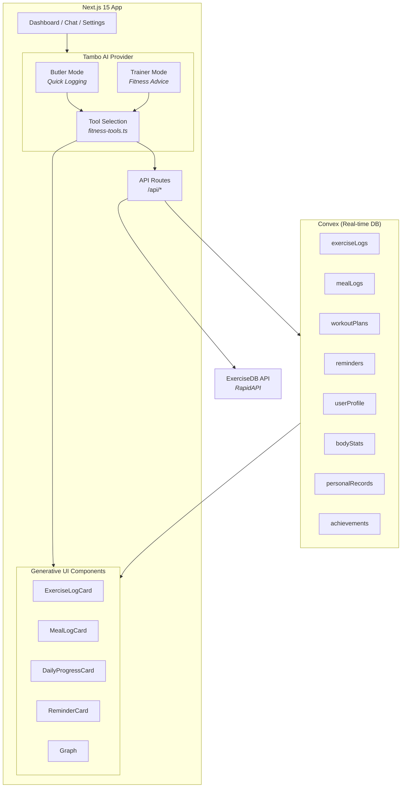
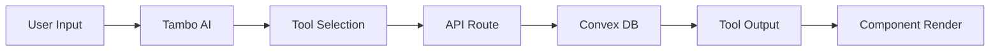

<h1 align="center">JackedAI</h1>

<p align="center">
  
  &nbsp;&nbsp;<b>x</b>&nbsp;&nbsp;
  
</p>

<p align="center">
  <a href="https://youtu.be/SDbjxEYgZVc?si=ADw7NUsnS_C5VVcX">Demo Video</a>
</p>

<p align="center">
  
  
  
  
  
  
</p>

<p align="center">AI-powered gym tracker — log workouts, meals, and calories through natural language conversations.</p>

<h3 align="center">
  <a href="https://jacked-ai.vercel.app/">LIVE</a> &nbsp;|&nbsp; <a href="https://youtu.be/SDbjxEYgZVc?si=ADw7NUsnS_C5VVcX">DEMO</a>
</h3>

> **PIN:** `123456` — Use this PIN to access the demo.

---

## Architecture



### Data Flow



### Key Concepts

- **Two AI Modes** — **Butler** for quick data logging ("Log 3 sets of bench at 60kg"), **Trainer** for fitness advice ("How do I fix my squat form?")
- **Generative UI** — Tambo renders rich components (cards, charts, progress summaries) inline in the chat based on tool outputs
- **Real-time Database** — Convex provides reactive queries, so dashboards update instantly when data changes
- **PIN Protection** — App-level lock screen with hashed PIN storage and lockout after failed attempts

### Project Structure

```
src/
├── app/
│   ├── page.tsx              # Main app (tabs + chat sidebar)
│   ├── chat/                 # Full-screen chat view
│   └── api/                  # API routes (Convex bridge)
├── components/
│   ├── tambo/                # AI-rendered components
│   └── ui/                   # Shared UI components
├── lib/
│   └── tambo.ts              # Component & tool registry
└── services/
    ├── fitness-tools.ts      # Tool implementations
    └── exercisedb.ts         # ExerciseDB API client
convex/
├── schema.ts                 # Database schema
├── exerciseLogs.ts           # Exercise CRUD + queries
├── mealLogs.ts               # Meal CRUD + queries
├── workoutPlans.ts           # Workout plan management
├── reminders.ts              # Reminder system
├── bodyStats.ts              # Body measurements
├── personalRecords.ts        # PR tracking
└── achievements.ts           # Badge system
```

---

## Setup

```bash
git clone https://github.com/puri-adityakumar/jackedAI.git
cd jackedAI
npm install
cp .env.example .env.local  # fill in your keys
npm run dev
```

## Environment Variables

| Variable | Description |
|---|---|
| `NEXT_PUBLIC_TAMBO_API_KEY` | Tambo API key ([get one](https://tambo.co/dashboard)) |
| `CONVEX_DEPLOYMENT` | Convex dev deployment reference |
| `NEXT_PUBLIC_CONVEX_URL` | Convex deployment URL |
| `NEXT_PUBLIC_CONVEX_SITE_URL` | Convex site URL |
| `NEXT_CONVEX_DEPLOY_KEY` | Convex production deploy key |
| `EXERCISEDB_API_KEY` | RapidAPI key for ExerciseDB |

## Scripts

```bash
npm run dev          # Run Convex + Next.js dev servers
npm run build        # Production build
npm run lint         # ESLint
```

## License

[MIT](./LICENSE)
